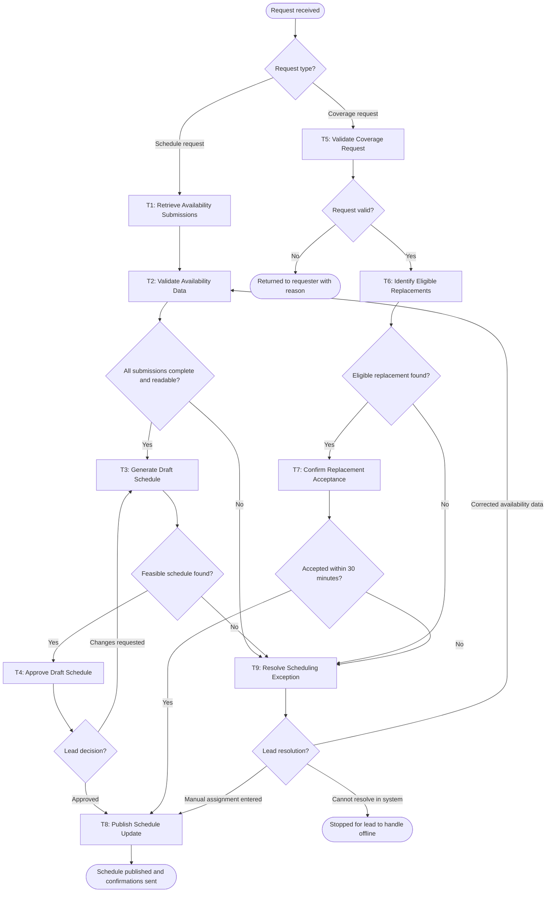

# Workflow of Tasks

## 1. Workflow Goal

This workflow supports the goal in our completed team charter (https://github.com/sanyakumar28/BUS4498_Team_Build./blob/main/README.md).

## 2. Workflow Trigger

One run starts when ShiftMatch receives either of two requests:

1. Schedule request: the Peer Advisor lead starts a schedule build after the availability submission deadline for the term.
2. Coverage request: a Peer Advisor submits a coverage request for a shift they are assigned to but cannot work.

## 3. Completion Condition at Runtime

A run ends successfully when the shared shift schedule shows the result, and everyone affected has been notified:

Schedule run: the lead-approved schedule is published to the shared schedule spreadsheet when every required shift is staffed, every required team-meeting overlap is met, and every Peer Advisor has received a notice that it is published.
Coverage run: the shift shows the replacement Peer Advisor's name in the shared schedule, and the requester, the replacement, and the lead have each received a confirmation. The request and confirmation timestamps are recorded as evidence of resolution time.

## 4. General Workflow

Schedule requests. ShiftMatch retrieves all Peer Advisor availability submissions for the term (T1) and validates them (T2). It checks that every Peer Advisor has submitted and converts each 30-minute availability grid and its free-text conflicts (classes, work, clubs) into structured available and unavailable time blocks. Using the validated data, ShiftMatch generates a draft schedule (T3) that staffs each shift's required headcount, respects each advisor's hour limits, and keeps overlapping availability for teammates who must meet together. The lead reviews the draft (T4). If the lead approves, ShiftMatch publishes the schedule (T8). If the lead requests changes, the lead's notes are sent back to T3 for a revised draft.

Coverage requests. ShiftMatch validates the coverage request (T5) by confirming that the shift exists, that the requester is assigned to it, and that it has not already started. It then identifies eligible replacements (T6): Peer Advisors who are available during that shift, are not already scheduled, and would not exceed their hour limits. ShiftMatch ranks them and sends the offer to the top three at the same time. The first candidate to accept within 30 minutes takes the shift (T7). ShiftMatch then updates and publishes the schedule (T8) and sends confirmations.

Exceptions. The workflow stops and sends the case to the lead (T9) when any of the following happens:

- Availability submissions are missing or cannot be interpreted.
- No feasible schedule exists.
- No eligible replacement is found.
- No candidate accepts within 30 minutes.
- A tool fails after its retry limit.

The lead receives a summary of the case: what failed, the task where it stopped, and the relevant data, such as the missing advisors, the unfilled shifts, or the candidates who were contacted. After review, the workflow can go one of three ways:

Resume: If the lead enters corrected availability data, the workflow resumes at T2.
Manual fix: If the lead assigns a fix manually, such as hand-picking a replacement, the workflow resumes at T8 to publish it.
Stop: If the lead cannot resolve the case in ShiftMatch, the run stops, and the lead handles it outside the system.

An invalid coverage request (T5) is not escalated. It is returned to the requester with the reason, and the run ends.

## 5. Workflow Diagram

*Replace the example diagram with your team's workflow. Give each work task a unique ID, such as T1, and a verb-object name, such as Retrieve Requests. Label branch conditions. Show human-review paths and stopping points. Use the same task IDs and names in the worksheet, task summary, and task specifications. Start/end markers and gateways that only route the flow are not work tasks.*

